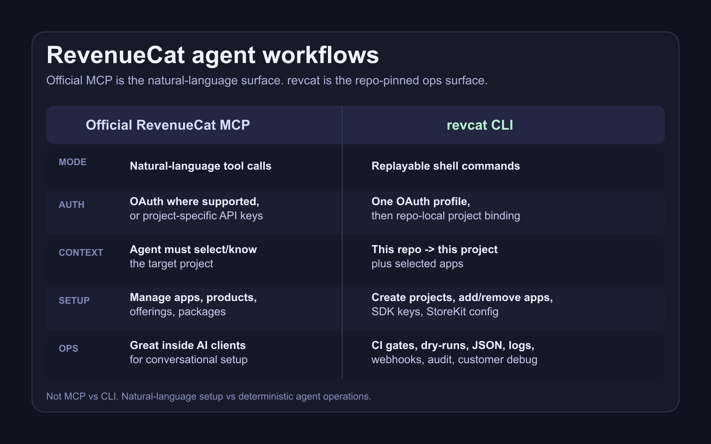

# revcat

[](https://github.com/akshitkrnagpal/revcat/releases/latest)
[](./LICENSE)
[](https://revcat.vercel.app)
[](./go.mod)

The agent-first CLI for RevenueCat. Pin one RevenueCat project to one repo, then let Codex, Claude Code, Cursor, CI, and shell scripts create projects/apps, inspect catalog wiring, debug customers, publish paywall updates, and verify launch state with exact commands, JSON output, dry-runs, and replayable logs.


```sh
revcat auth login
revcat projects create --name Acme
revcat apps create --type app_store --bundle com.acme.app
cd ~/your-repo && revcat init            # bind this repo to one project + selected apps
revcat subscriptions search ABC123XYZ --output json
revcat doctor
```

## Why

RevenueCat ships a dashboard, a REST API, and an official MCP server. Those are useful surfaces, but agents working inside code repos need something more durable than a conversational tool call: project context that travels with the repo, commands that can be replayed, output that can be parsed, and health checks that can fail CI.

revcat gives agents and humans a deterministic ops surface for RevenueCat:

- create projects and add, update, or remove apps from the terminal
- bind a repo to one project plus selected apps with `revcat init`
- debug "paid but no premium" support tickets from a store transaction id
- inspect offerings, packages, products, entitlements, paywalls, SDK keys, and StoreKit config
- ship paywall config changes and set the current offering in one command
- grant, revoke, refund, transfer, and inspect customer state
- check webhooks, audit logs, charts, metrics, and project configuration
- give CI, scripts, and agents JSON output, dry-runs, and exit codes they can trust

Output is a colored table when you're at a terminal and JSON when you're piping into a script - no `--json` ceremony.

## MCP vs CLI

The official RevenueCat MCP is a natural-language setup surface. revcat is the repo-pinned operations surface for agents that need exact commands, logs, JSON, and CI gates.



## Demos

All demo GIFs are hermetic recordings backed by local fixtures in [`demo/mock-bin`](./demo/mock-bin/). They show real command syntax without touching a live RevenueCat project.

### Agent-first RevenueCat ops

Run commands from a repo, inherit the right project context, emit JSON for the next step, and leave a health gate that can fail CI.


### Ship a paywall update

Push a paywall config and keep the offering current from the terminal.


### Bootstrap project context

Bind a repo once so future commands inherit the right project and credentials.


### Debug and fix customer access

Resolve a store transaction id, inspect the customer, and grant goodwill access.


### Inspect catalog wiring

Check offerings, products, and package membership without opening the dashboard.


### Monitor operations

Review webhooks, audit logs, and headline metrics while launch traffic is coming in.


## Install

```sh
brew install akshitkrnagpal/tap/revcat

# or, from source (Go 1.26+)
go install github.com/akshitkrnagpal/revcat/cmd/revcat@latest
```

Pre-built binaries for every platform are on the [Releases page](https://github.com/akshitkrnagpal/revcat/releases).

## Auth

revcat authenticates against RevenueCat via OAuth (PKCE). One browser login writes a global profile to `~/.revcat/config.json` (mode 0600); running `revcat init` inside a repo writes a per-directory `.revcat/config.json` (gitignored, mode 0600) so agents and sandboxes operating in that directory inherit the credential without touching the global file.

```sh
revcat auth login                        # browser OAuth
cd ~/your-repo && revcat init            # binds this repo to a project
revcat auth status --validate            # confirm
revcat auth doctor                       # diagnose
```

### Storage tiers

| Tier | Path | Used when |
| --- | --- | --- |
| global file | `~/.revcat/config.json` (mode 0600) | written by `revcat auth login` |
| local file | `./.revcat/config.json` (walked up) | written by `revcat init` |

Resolution: `REVCAT_REFRESH_TOKEN` env > walked-up local file > global active profile.

### Multi-account

```sh
revcat auth login --name work
revcat auth login --name personal
revcat auth use personal                 # default for global commands
revcat --profile work auth status        # one-shot override
```

### Headless / CI

```sh
export REVCAT_REFRESH_TOKEN=rtk_...
export REVCAT_PROJECT_ID=proj_...
revcat offerings list
```

revcat synthesizes a virtual profile, refreshes tokens in-memory, no login flow. Pull the refresh token from your CI secret manager.

## Command surface

```
revcat projects           list | view | create
revcat apps               list | view | public-keys | storekit-config | create | update | delete

revcat entitlements       list | view | create | update | delete | archive | unarchive
                          products | attach | detach
revcat offerings          list | view | preview | create | update | delete | archive | unarchive
                          set-current
revcat packages           list | view | create | update | delete | products | attach | detach
revcat products           list | view | create | update | delete | archive | unarchive
                          push-to-store
revcat paywalls           list | view | create | delete

revcat subscribers        info | list | create | delete
                          grant | revoke | transfer
                          attributes | invoices
                          refund (delegates to subscriptions)
revcat subscriptions      view | transactions | entitlements
                          cancel | refund | management-url | search
revcat purchases          view | entitlements | refund | search
revcat invoices           view

revcat publish offering   <id> [--paywall ./paywall.json] [--current] [-y] [--dry-run]

revcat metrics            overview
revcat charts             get <name> | options <name>
revcat audit-logs         list
revcat collaborators      list

revcat webhooks           list | view | create | update | delete
revcat virtual-currencies list | view | create | update | delete | archive | unarchive

revcat init               (run inside a repo to bind project context)
revcat doctor
revcat auth               login | status | doctor | use | list | logout
revcat completion         bash | zsh | fish
revcat version
```

## Output

By default, output is TTY-aware:

- **Interactive terminal**: tables (lipgloss) with color
- **Piped or in CI**: JSON, one object per row

Override with `--output table|json|csv|markdown` or env `REVCAT_DEFAULT_OUTPUT`. Use `--pretty` for indented JSON.

## Examples

Debug a customer report from support:

```sh
revcat subscribers info app_user_123
```

Find a subscription from a store id (App Store transaction id, Play purchase token, Stripe sub_):

```sh
revcat subscriptions search ABC123XYZ
```

Promote a new paywall to current:

```sh
revcat publish offering pro --paywall ./paywalls/pro.json
```

Grant a complimentary entitlement:

```sh
revcat subscribers grant app_user_123 premium -d 7d
```

Wire entitlement <-> product:

```sh
revcat entitlements attach premium prod_app_monthly prod_app_annual
```

Show the dashboard headline numbers:

```sh
revcat metrics overview
```

Audit who changed what:

```sh
revcat audit-logs list
```

## Debug

```sh
REVCAT_DEBUG=api revcat metrics overview     # logs full request/response (token redacted)
revcat doctor                                # top-level health check
revcat auth doctor                           # auth-specific
```

## Documentation

Full docs at <https://revcat.vercel.app> - install, quickstart, every command, configuration, and guides. Source lives in [`docs/`](./docs/).

## AI agent support

revcat ships four [Agent Skills](./skills/) (open standard) so Claude Code, Cursor, and Codex can compose revcat commands accurately:

- `revcat-getting-started` - install, auth, top-level command map
- `revcat-commands` - real syntax + examples for every subcommand
- `revcat-troubleshooting` - common errors and fixes
- `revcat-storefront-debug` - 7-step diagnostic for "the SDK sees 0 packages from my offering"

Install via [skills.sh](https://skills.sh) (auto-detects your agent):

```sh
npx skills add akshitkrnagpal/revcat
```

Or manually - see [`skills/README.md`](./skills/README.md) for the Claude Code / Cursor / Codex paths.

## License

MIT
